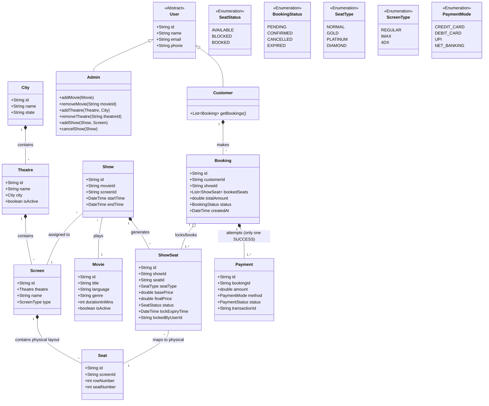

# Movie Ticket Booking System - Low Level Design (LLD)

## 1. Requirements Addressed
*   **Search & Discovery:** List movies in a city, list theatres in a city, display shows for a movie.
*   **Booking Flow:** Display seats for a show, select seats, block seats, and book tickets.
*   **Cancellation:** Cancel bookings and free seats.
*   **Admin actions:** Add movies, theatres, and shows.
*   **Seat Variability:** Seat types (e.g., Gold, Platinum) are bound to the *Show*, not just the physical screen. This allows the same physical seat to be configured as Gold in the morning show and Platinum in the evening show.
*   **Screen Types:** Support for IMAX, 4DX, Regular, etc.
*   **Payments:** Extendable payment methods (UPI, Card, NetBanking).
*   **Concurrency Handling:** Ensures that two customers cannot book the exact same seat for a show.
*   **Dynamic Pricing:** Show-seats have base prices alongside an engine that can systematically adjust the final price.

---

## 2. UML Class Diagram

---

## 3. Core Entities and Relationships

### a) Location & Venue Entities
*   **City, Theatre, Screen, Seat:** These form a hierarchical, static structure. A city has many theatres, a theatre has many screens, and a screen has physical seats (e.g., Row A, Col 1).
*   **Relationship:** 1-to-many from `City` -> `Theatre` -> `Screen` -> `Seat`.

### b) Inventory Entities
*   **Movie:** Generic details (Title, language, etc.). Independent of the theatre.
*   **Show:** The intersection of a `Movie`, a `Screen`, and a timeslot.
*   **ShowSeat:** **(Crucial Concept)** When an Admin creates a `Show`, the system generates `ShowSeat` entities for each physical `Seat` in that `Screen`. 
    *   *Why?* The physical seat "A1" might be `NORMAL` on Monday morning, but it can be changed to `GOLD` on Sunday evening. The base price and type are bound to the `ShowSeat`, not the physical `Seat`.
    *   *Relationship:* `Show` has Many `ShowSeats` mapping directly to the `Screen`'s static `Seats`.

### c) Booking & Payment Flow
*   **Booking:** Attached to a `Customer`. Stores references to the specific `ShowSeat`s locked or purchased.
*   **Payment:** Tied to a `Booking`. Supports `PaymentMode` polymorphism (Strategy Pattern can be implemented for different UPI/Debit modes).

---

## 4. Key Design Mechanics

### #1 Concurrency (Handling the "Double Booking" Problem)
*   **The Problem:** Two users hitting the "Book" button at the millisecond exact time for seat A1. We must prevent double booking.
*   **Solution:** We use **Pessimistic Locking** on the database (row-level lock). 
    *   When User A selects seats, the system initiates a transaction: `SELECT * FROM show_seats WHERE id IN (...) AND status = 'AVAILABLE' FOR UPDATE`.
    *   If successful, it changes the `status` to `BLOCKED`, sets `lockedByUserId`, sets `lockExpiryTime` (e.g., +5 minutes), and creates a `Booking` with status `PENDING`.
    *   If User B requests the same seats simultaneously, the database lock ensures they wait until User A's transaction finishes. B will see the status is no longer `AVAILABLE`, throwing an exception (Seat Unavailable).
*   **Booking Expiration:** A time-to-live (TTL) system (e.g., Redis expiring keys, or a cron job) checks pending bookings. The `BLOCKED` status means the seat is temporarily locked. If the `lockExpiryTime` passes without a successful payment, the status reverts from `BLOCKED` to `AVAILABLE`.

### #2 Dynamic Pricing
*   The `ShowSeat` entity holds the `basePrice` defined by the Admin during `Show` setup (or based on general theatre rules), and also a `finalPrice`.
*   The requirement dictates that admins can dynamically increase prices based on rules. 
*   We can introduce a **Pricing Strategy Pattern** (`PriceCalculationEngine`) right before checkout to determine the `finalPrice`.
*   Example strategies: 
    *   *Surge Pricing Rule:* `if (BookingCount / TotalSeatsForShow > 0.8) { return basePrice * 1.25; }`
    *   *Weekend Pricing Rule:* `if (isWeekend(show.date)) { return basePrice * 1.1; }`
*   When a customer selects a seat, they hit the `calculateTotalAmount(List<ShowSeat> seats)` method which loops through applicable pricing strategies to compute the `finalPrice` for checkout.

### #3 Adding / Deleting Shows (Admin)
*   **Validation:** The `addShow` method must validate timing conflicts (e.g., ensuring another show isn't scheduled at the same time on the same screen) before creation.
*   Adding a show triggers the `ShowFactory`. It takes a `Screen` ID, queries all physical `Seats`, and generates the corresponding `ShowSeat`s with the `admin_defined_seat_type`.

### #4 Removing Entities (Movies / Theatres)
*   **Soft Deletion:** We never perform a hard delete (`DELETE FROM ...`) on a `Movie` or `Theatre` because of historical `Booking` and `Payment` records that reference them for financial audits. Instead, we use a **Soft Delete** by setting an `isActive = false` flag.
*   **Handling Future Shows:** When an admin deactivates a Theatre or Movie:
    1.  The system queries for all *future* `Show`s associated with it.
    2.  If any future shows have existing `Booking`s (Status = CONFIRMED), the system dynamically cancels these shows.
    3.  This triggers an asynchronous background job / event queue (e.g., Kafka) to process **Refunds** for all affected customers.

### #5 Searching Flow
*   Get Movies in City -> `SELECT DISTINCT movieId FROM Shows WHERE theatre.cityId = ?`
*   Get Shows for Movie -> `SELECT * FROM Shows WHERE movieId = ? AND cityId = ?`
*   Get Seats for Show -> `SELECT * FROM ShowSeats WHERE showId = ?`
